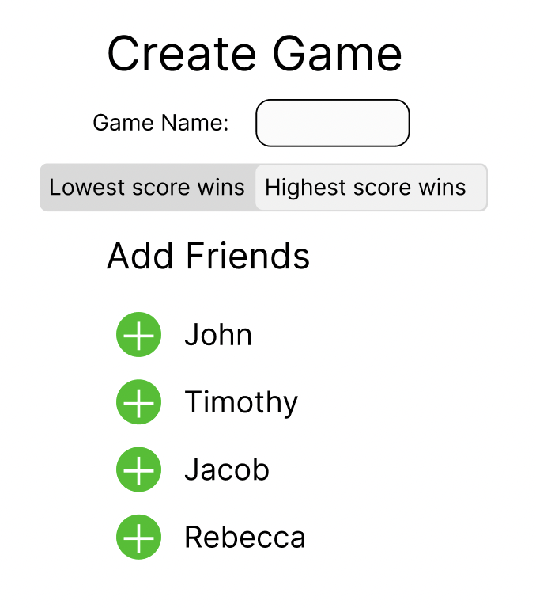
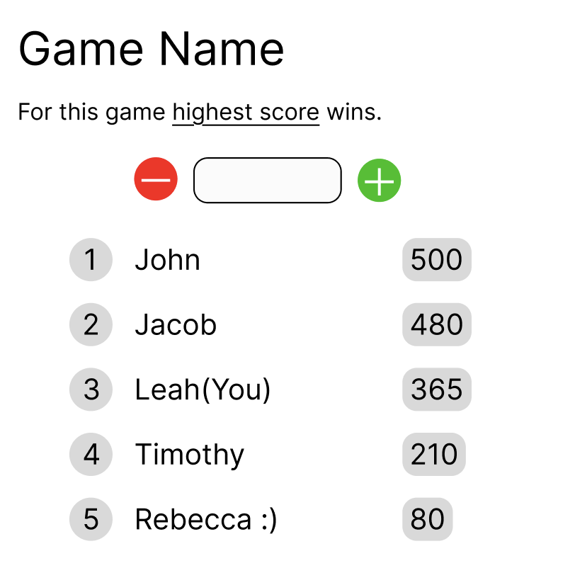

# Your startup name here

[My Notes](notes.md)

This is my startup for my CS 260 class. The actual application is a scorekeeper app for multiple people at once.

## 🚀 Specification Deliverable

For this deliverable I did the following. I checked the box `[x]` and added a description for things I completed.

- [x] Proper use of Markdown
- [x] A concise and compelling elevator pitch
- [x] Description of key features
- [x] Description of how you will use each technology
- [x] One or more rough sketches of your application. Images must be embedded in this file using Markdown image references.

### Elevator pitch

Have you ever played a game and you always want to check the score but someone else is writing it? Is the scorekeeper slow? Are they bad at their job? Is it no one’s fault but the fact you guys are playing long distance? Well here’s the solution! Everyone has an account for their score keeping that connects and displays everyone’s score, and everyone is responsible for handling their own business. Everyone can constantly watch how much they’re winning or losing however much they want. You will never have to guess the score again!

### Design

### Key features

- Login and and connect with friends
- Make updates to your score
- Automatically ranks scores
- Can come back to games later

### Technologies

I am going to use the required technologies in the following ways.

- **HTML** - Uses correct HTML stucture for application. There will be a page for logging in, creating a game, and adding friends.
- **CSS** - CSS will make the application visually pleasing and accessible to a wide range of users.
- **React** - Provides login display, the ranking of the players, applying score changes, and makes endpoint calls. Reacts to user imput.
- **Service** - Backend server functionality for the following:
    - Retreiving scores
    - Submitting score change
    - Will use [agify.io](https://agify.io/) to have a guss of the users age associated with their account purely to be funny.
    - Register, login, and logout users. Credentials securely stored in database.
    - Connecting to other users as friends.
- **DB/Login** - Store user information, friends, and ongoing game information in a database.
- **WebSocket** - As a player updates their score, it is broadcast to other players in the game.