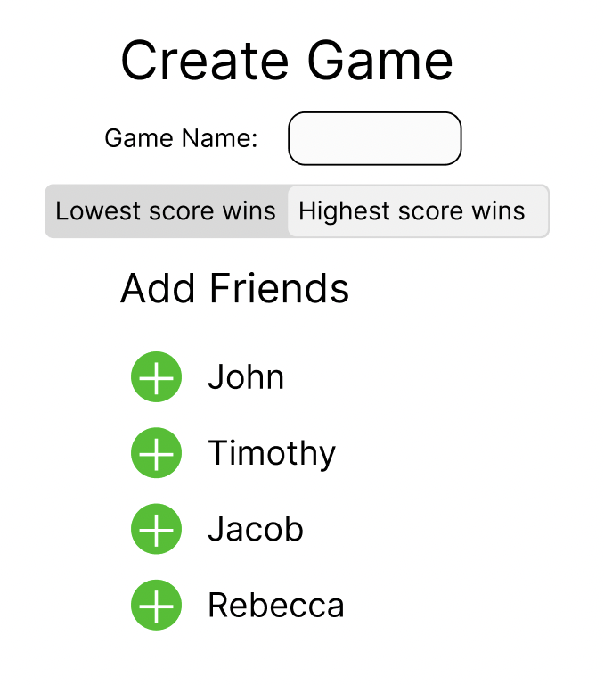
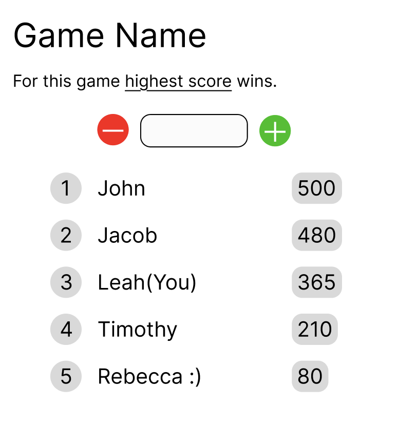

# Your startup name here

[My Notes](notes.md)

This is my startup for my CS 260 class. The actual application is a scorekeeper app for multiple people at once.

## 🚀 Specification Deliverable

For this deliverable I did the following. I checked the box `[x]` and added a description for things I completed.

- [x] Proper use of Markdown
- [x] A concise and compelling elevator pitch
- [x] Description of key features
- [x] Description of how you will use each technology
- [x] One or more rough sketches of your application. Images must be embedded in this file using Markdown image references.

### Elevator pitch

Have you ever played a game and you always want to check the score but someone else is writing it? Is the scorekeeper slow? Are they bad at their job? Is it no one’s fault but the fact you guys are playing long distance? Well here’s the solution! Everyone has an account for their score keeping that connects and displays everyone’s score, and everyone is responsible for handling their own business. Everyone can constantly watch how much they’re winning or losing however much they want. You will never have to guess the score again!

### Design

### Key features

- Login and and connect with friends
- Make updates to your score
- Automatically ranks scores
- Can come back to games later

### Technologies

I am going to use the required technologies in the following ways.

- **HTML** - Uses correct HTML stucture for application. There will be a page for logging in, creating a game, and adding friends.
- **CSS** - CSS will make the application visually pleasing and accessible to a wide range of users.
- **React** - Provides login display, the ranking of the players, applying score changes, and makes endpoint calls. Reacts to user imput.
- **Service** - Backend server functionality for the following:
    - Retreiving scores
    - Submitting score change
    - Will use [agify.io](https://agify.io/) to have a guss of the users age associated with their account purely to be funny.
    - Register, login, and logout users. Credentials securely stored in database.
    - Connecting to other users as friends.
- **DB/Login** - Store user information, friends, and ongoing game information in a database.
- **WebSocket** - As a player updates their score, it is broadcast to other players in the game.

## 🚀 AWS deliverable

For this deliverable I did the following. I checked the box `[x]` and added a description for things I completed.

- [x] **Server deployed and accessible with custom domain name** - [My server link](https://scorekeep.click).

## 🚀 HTML deliverable

For this deliverable I did the following. I checked the box `[x]` and added a description for things I completed.

- [x] **HTML pages** - There are 4 different pages, the login and game page has a few different views planned.
- [x] **Proper HTML element usage** - This website uses a lot of HTML, with text, headers, divs, and form information.
- [x] **Links** - There are links in the navigation and the github.
- [x] **Text** - There is descriptive text across the deliverable.
- [x] **3rd party API placeholder** - It is [agify.io](https://agify.io/) and at the home page.
- [x] **Images** - Created a favicon, and have a picture for the top of the friends page and the game page.
- [x] **Login placeholder** - Login form is at the home page.
- [x] **DB data placeholder** - Clearly indicated the parts DB data will be used in the deliverable, such as for friends, score, and history.
- [x] **WebSocket placeholder** - Clearly indicated the parts websocket will be used in the deliverable, such as for friends and score.

## 🚀 CSS deliverable

For this deliverable I did the following. I checked the box `[x]` and added a description for things I completed.

- [x] **Header, footer, and main content body** - I ended up reusing a lot of classes so everything's in one file for now.
- [s] **Navigation elements** - Bootstrap but it took literally forever I could not get it to work but it's there now and it's beautiful.
- [x] **Responsive to window resizing** - It is responsive to window resizing, with things relatively centered and nice looking and the top of the application changing to icon veiw when it changes to a certain length. I made the application thin enough that it should be fine skinny but of course there's limits to everything.
- [x] **Application elements** - I changed a lot but I am rediscovering my dislike of flex.
- [x] **Application text content** - I had a font imported for dramatic effect for the logo but most things are in ariel for a coheisive feel.
- [x] **Application images** - The images are now the icons on the navbar in skinny mode.

## 🚀 React part 1: Routing deliverable

For this deliverable I did the following. I checked the box `[x]` and added a description for things I completed.

- [x] **Bundled using Vite** - Following the instructions was simple enough, I struggled a bit because I did most of this without internet.
- [x] **Components** - I had all of the pages and a navigation link turned into a compnent. Wasn't sure if we were supposed to add non-page components yet but did anyways.
- [x] **Router** - The router was super easy to install.

## 🚀 React part 2: Reactivity deliverable

For this deliverable I did the following. I checked the box `[x]` and added a description for things I completed.

- [x] **All functionality implemented or mocked out** - The functionality is added!
- [x] **Hooks** - Hooks are added for friends, the amount of interaction for multiple people outside the game is out of the scope.

## 🚀 Service deliverable

For this deliverable I did the following. I checked the box `[x]` and added a description for things I completed.

- [x] **Node.js/Express HTTP service** - Installed Express with NPM. Default port on 4000.js
- [x] **Static middleware for frontend** - Simple endpoints in `service/index`.
- [x] **Calls to third party endpoints** - When the player puts their name there when creating an account, agify.io puts an age there based on the name. It's in the frontend per requirements, but if I had known it would be a requirement I would've planned for a 3rd party api to be more customer facing.
- [x] **Backend service endpoints** - Simple endpoints in `service/index` for auth and player data.
- [ ] **Frontend calls service endpoints** - I did not complete this part of the deliverable.
- [x] **Supports registration, login, logout, and restricted endpoint** - Fully support authentication and restrict access to all player information, games, and scores.

## 🚀 DB deliverable

For this deliverable I did the following. I checked the box `[x]` and added a description for things I completed.

- [ ] **Stores data in MongoDB** - I did not complete this part of the deliverable.
- [ ] **Stores credentials in MongoDB** - I did not complete this part of the deliverable.

## 🚀 WebSocket deliverable

For this deliverable I did the following. I checked the box `[x]` and added a description for things I completed.

- [ ] **Backend listens for WebSocket connection** - I did not complete this part of the deliverable.
- [ ] **Frontend makes WebSocket connection** - I did not complete this part of the deliverable.
- [ ] **Data sent over WebSocket connection** - I did not complete this part of the deliverable.
- [ ] **WebSocket data displayed** - I did not complete this part of the deliverable.
- [ ] **Application is fully functional** - I did not complete this part of the deliverable.
